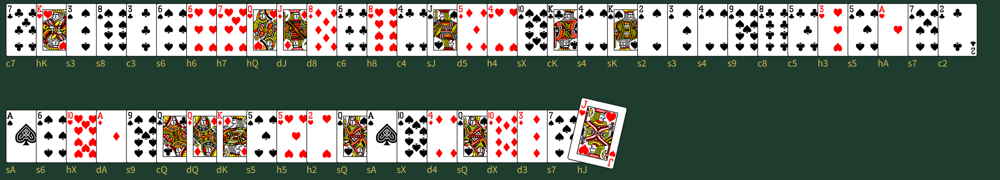
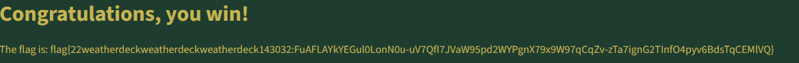

# Seven El Bee

## Summary

The `Seven El Bee` challenge brings you to a website with 52 cards, drawn from an erratic deck, where duplicates are allowed. The goal is to select the next 5 cards that will be drawn from the deck.

We are given compiled elixer bytecode, which serves to obsufuscate the implementation of the psudo random number generator (PRNG) used to draw the cards, as well as the deck itself. The challenge is to reverse engineer the elixer bytecode to find the details of the PRNG, and then use that to predict the next 5 cards that will be drawn from the deck.

**Artifacts:**
* `decompalitation`: The decompiled elixer bytecode of the prng module.
* `solve.py`: The solution script that uses the PRNG to predict the next 5 cards.
* `lcg.py`: A testing script used to reverse the behavior of the PRNG.
* `sevenelbee-27fa7927a4e12018ce0c2f88c7c3c430b4ba1118/`: The directory containing the implementation of the challenge.
    * `bin`: contains the start scripts for the server and the challenge itself.
    * `erts-15.2.2`: contains essentially elixer stlib code and runtimes and such, not relevant to the challenge.
    * `lib`: contains all of the elixer libraries used to implement the challenge.
        * `seven_el_bee-0.1.0`: contains the bytecode for for the app specific library.
            * `Elixir.SevenElBee.ChallRng.beam`: the elixer bytecode for the PRNG used to draw the cards.
            * `Elixir.SevenElBee.ErraticDeck.beam`: the elixer bytecode for the deck itself.
* `Dockerfile`: The dockerfile used to build the container for the challenge.
* `cards.txt`: A text file containing an example of the first 52 cards drawn from the deck, used to find the initial state of the PRNG.
* There are lots more files floating around the app directory, but they are not relevant to the challenge.


## Context

When we log into the challenge and enter our ticket, we are greeted with a page that looks like this: 


Along with the option to enter the next card.

We can see from the deck that this is an erratic deck, or a deck that does not nessarly contain all of the cards, and may have duplicates. To know more about how to crack this scheme, we need to know how the cards are drawn, and whether there are differences in the random numbers that created these first 52 cards, compared to the next 5 cards.

Luckely for us, the challenge provides us with the files we need to (with some tweaks to the config), run the challenge locally. I can whip up quick dockerfile get an elixer runtime and inspect the challenge code.

We can dive into that code, and the first thing that jumps out is the `bin` directory. This contains the start scripts for the server and the challenge itself. That is doing a lot of bash that I would prefer to now have to deal with. By just running the `bin/seven_el_bee` script, we get a list of the available commands. Two that jump out are `start` and `start_iex`. From the server script, we know that `start`. A quick google tells us that iex is an interactive elixer shell, which we will definatly come back to later.

Exploring a bit more, we can look in the `lib` directory. This contains all of the elixer libraries used to implement the challenge. The most interesting one is `seven_el_bee-0.1.0`, which contains the bytecode for for the app specific library. Files include:

```
Elixir.SevenElBee.Application.beam          Elixir.SevenElBeeWeb.ErrorJSON.beam
Elixir.SevenElBee.ChallRng.beam             Elixir.SevenElBeeWeb.Gettext.beam
Elixir.SevenElBee.ErraticDeck.beam          Elixir.SevenElBeeWeb.Layouts.beam
Elixir.SevenElBee.Mailer.beam               Elixir.SevenElBeeWeb.PageController.beam
Elixir.SevenElBee.Tickets.beam              Elixir.SevenElBeeWeb.Router.beam
Elixir.SevenElBee.beam                      Elixir.SevenElBeeWeb.Telemetry.beam
Elixir.SevenElBeeWeb.DealerComponents.beam  Elixir.SevenElBeeWeb.beam
Elixir.SevenElBeeWeb.DealerLive.beam        seven_el_bee.app
Elixir.SevenElBeeWeb.Endpoint.beam
```
If we can find out how these work, we find out how the whole challenge works. The most interesting ones are `Elixir.SevenElBee.ChallRng.beam` and `Elixir.SevenElBee.ErraticDeck.beam`. The first one is the PRNG used to draw the cards, and the deck implementation itself. 

Looking at these files directly reveals very little information, as they are compiled elixer bytecode. Luckely, elixer has a decompiler packaged here, so we can use the `./bin/sevel_el_bee start_iex` to launch an IEX shell, then navigate to that directory, and run `:beam_disasm.file('Elixir.SevenElBee.ChallRng.beam')` to get the decompiled elixer bytecode for the ChallRng file. The full output of that file can be found in the decompalation file.

One highlight is the `next` function, defined here:
```json
    {function,next,1,19,
         [{line,5},
          {label,18},
          {func_info,
              {atom,'Elixir.SevenElBee.ChallRng'},
              {atom,next},
              1},
          {label,19},
          {test,is_map,{f,18},[{x,0}]},
          {get_map_elements,{f,18},{tr,{x,...},{...}},{list,[...]}},
          {test,is_eq_exact,{f,18},[{...}|...]},
          {line,6},
          {gc_bif,'*',{...},...},
          {gc_bif,'+',...},
          {allocate,...},
          {...}|...]},
```

There is a lot going on that is challenging (ie. impossible given this decompalation) to understand, but the most important part is the `gc_bif` calls. These are the calls to the elixer standard library, and they are the ones that are doing the actual work of the function. The first one is a multiplication, and the second one is an addition. This strongly implies that this is an implementation of a linear congruential generator (LCG). The issue is that we dont know the parameters of the LCG, but we have some tools to try to find them out, namely creating an instance of this object, and seeing its behavior.

From this file we can also see that there is a constructur (new) that takes in 1 param, which is probobly a seed.

Lets go into our IEX shell and try to make an instance of this ChallRng object.
```
x=Elixir.SevenElBee.ChallRng.new(0)
```
We get this as the output:
```
%SevenElBee.ChallRng{state: 0}
```

That does indicate that the input is the seed, or the initial internal state. Lets call next on this object and see what we get.
```
x=SevenElBee.ChallRng.next(x)
```
We get this as the output:
```
{1337, %SevenElBee.ChallRng{state: 1337}}
```

This tells us that the next function returns a tuple, with the first element being the next number in the sequence, and the second element being the new state of the object (elixer does not modify objects in place, just creates new objects). 

This also tells us one of the parameters for the LCG.

The form an LCG takes is
```
X_{n+1} = (a * X_n + c) mod m
```
Where `X_n` is the current state, `X_{n+1}` is the next state, `a` is the multiplier, `c` is the increment, and `m` is the modulus.

When X_n is 0, this simplifies to c mod m, so c=1337.

Lets try to find a now, by finding the next number when state is 1:
```
{134777150, %SevenElBee.ChallRng{state: 134777150}}
```
134777150 - 1337 = 134775813, so that is very likely our a term.

Finally, we can find the modulo. Lets try a number that is reasonably big, like 20.
Trying that, we get 548033949 as the next number.

20*134775813 + 1337 = 2695516267, which is not 548033949, so the difference can find the modulo (or some multiple of it, but further testing does confirm that this is the actual modulo).

2695516267-548033949 = 2147483648, which is 2^31. This happens to be a common modulus for LCGs, as with well chosen params, it has the maximum period of 2^31-1.
So we have all of the params for the LCG. The final form is:
```
X_{n+1} = (134775813 * X_n + 1337) mod 2^31
```

The next thing we have to do is to find out how these random numbers are used to draw the cards.

The random_deck function seems to be the one initializing the first 52 cards.

It can take 1 arg, an PRNG object, so if we pass one with seed 0, we get this output:
```
%SevenElBee.ErraticDeck{
  cards: [13, 4, 39, 10, 17, 44, 11, 30, 21, 32, 47, 50, 25, 20, 19, 6, 29, 8,
   3, 26, 33, 8, 27, 46, 37, 48, 11, 2, 41, 36, 35, 22, 45, 24, 7, 42, 49, 12,
   43, 10, 1, 12, 15, 18, 5, 52, 51, 38, 9, ...],
  rng: %SevenElBee.ChallRng{state: 1985298188}
}
```
This gives us two peices of information, the cards themselves (or at least their number representations in the deck), and the state of the PRNG after the first 52 cards have been drawn.

A quick test shows us that this is the state you get after calling next 52 times, so we can confirm that each draw uses 1 random number.


With a bit more exploration of the functions, we can find that the random_deck function calls the add_card function 52 times, which in turn calls the draw_card function, which takes in the prng state, increments it, uses that new state, and uses that to draw a card.

Determining exactly how those numbers maps to cards is challenging. 

The most nieve approach would be just to take the number mod 52, but that does not seem to be what is happening.

To test this behavior, I created a script to get the numbers that map to all numbers between 0 and 1000, such that running calling next with that large number would give us that small number and we can test how those small numbers map to cards.

If we run 
```
SevenElBee.ErraticDeck.draw_card(Elixir.SevenElBee.ChallRng.new(251095387))
```
We get the output
```
{1, %SevenElBee.ChallRng{state: 0}}
```
This tells us that when the state is 0, the card drawn is 1.

This pattern continues up through 51, where if we target 51 we get the output
```
{52, %SevenElBee.ChallRng{state: 51}}
```

Targeting 52 goes back to giving us 1. This seems like mod 52 behavior, so lets keep exploring.

52 through 63, as the targetted next state, gives us 1 through 12 again. When we test 64, however, behavior gets odd.

```
>SevenElBee.ErraticDeck.draw_card(Elixir.SevenElBee.ChallRng.new(1658952859))
{1, %SevenElBee.ChallRng{state: 64}}
```
It took the rng state mod 64, then mod 52.

## Vulnerability

This is extreamly dumb. At first glance, the reason is that this does not create uniformly random chances of drawing every card in the deck. When you take a number mod 64 then mod 52, there are 2 numbers in the mod 64 space (0-11 and 52-63) that will give you the same number in the mod 52 space. This means you are twice as likely to draw a 6, for example, than a 16.

But its actually even worse than that in this case. 

Take a look at a sequence of 17 numbers drawn from this LCG:
```
00: 0000000000000000000010100111001
01: 1110100011110011000001101010110
02: 0111000110001111110110111100111
03: 1011001110010101100011010111100
04: 1100101010011101101011011100101
05: 0000000100000000100101110110010
06: 0010111000110010100011110110011
07: 1010010000011101011011110111000
08: 0101110110001000111101111010001
09: 0100000001101100011010001001110
10: 0100110011101110100001010111111
11: 1001100101101101100111011110100
12: 1011001111001111101111111111101
13: 0111000111011011101100100101010
14: 1011001111011101110101100001011
15: 0100011001101000100100001110000
16: 1101000110111110010111101101001
```
Focus on the last bit, it always alternates (period of 2). The second to last bit follows the pattern 0110 (a period of 4), the third to last has a period of 8. This pattern is inharent with LCGs with a modulo that is a power of 2, each bit has a maximum period of 2^n, where n is the bit position. 

Because only the lower 8 bits of the random number have any affect on the output (since we are taking it mod 64, equilivent to masking out all of the other bits), the upper bits of the random number are not used. This means that, for the purposes of drawing cards, the prng has a period of 2^8, or 256. 

This makes brute forcing trivial (it was already easy with a only 2^31 states to look through, but now we only have to look through 256).


## Exploitation

**Exploit overview**: The exploit involves deriving the prng state from the first 52 cards drawn, and then using that state to predict the next 5 cards. 

**Exploit mitigation considerations**:
* We have to map cards to numbers. We can test how that works using the card_to_number and number_to_card functions, and they work as expected.
* We actually have to enter our guesses on a website, meaning it will likely be more trouble than its worth to fully automate the exploit.


**Exploit description**: The `solve.py` finds the prng state from the first 52 cards drawn, and then uses that state to predict the next 5 cards.

The exploit works as follows:
The user first enters the 52 cards from the webside in a file cards.txt. The script then reads the file and parses the cards into a list of integers with the num_to_cards array.

We then run the find_state function to find the initial seed for the prng. This is done by guessing that it is some initial state, and checking if that gives us the same sequence of cards as the ones we have.
```python
def find_state(cards):
    for i in range(M):
        state = i
        for card in cards:
            state = (A * state + C) % M
            # print((state & mask) % 52 + 1)
            if ((state & mask) % 52) + 1 != card:
                break
        else:
            return i
```


We can then use that state to predict the next five cards, which the user can then enter into the website to retrieve the flag.



## Remediation

The simplest fix would be to use a better random number generator, and to use more of the bits (or at least bits that have a less regular pattern) of the random number.

All PRNGs would be possible to brute force if an attacker can find out everything about them and how they are used, and if the seed size is only 32 bits.

To solve this problem, we would need a longer seed, or longer state (something like 256 bits would be secure), and a better PRNG algorithm, such as AES in counter mode.

## Configuration Notes

The dockerfile is not set up to run the server automatically, so first run the dockerfile in interactive mode, and then run the following command to start the server::
```
/./app/sevenelbee/app/bin/server
```
To test the code in an elixer shell, run the following command in the docker container:
```
./app/sevenelbee/app/bin/seven_el_bee start_iex
```
This will start an interactive elixer shell, where you can run elixer code. 


To run the solve script, paste the cards into a cards.txt file (dont worry if they are duplicated from the image alt test, the script will handle that), and run the following command:
```
python3 solve.py
```

It will spit out a next 5 cards for your seed, which you can then enter into the website to get the flag.
```
next 5 cards:
h5
h2
sQ
sA
sX
```
## References

https://en.wikipedia.org/wiki/Linear_congruential_generator
