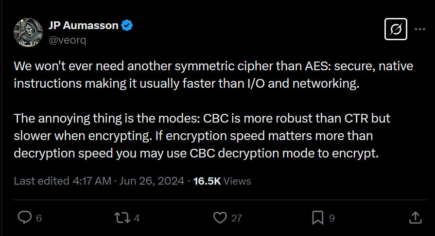

# Very Serious Cryptography

## Summary

Challenge Description
As CTF becomes more mainstream, a troubling new trend is emerging of player fanclubs becoming so large that top players and challenge authors are having their lives disrupted from the sheer volume of valentines gifts they are receiving! With some instances of the extreme valentines pressure even leading to the last minute postponement of major CTFs!?!

As such, we have decided to expand our traditional CTF valentines cards service, to provide a utility for efficiently generating meaningful, romantic gifts. We hope this will enable busy CTF players to be all set for the upcoming white day, and the huge number of return gifts they will inevitably have to send back, ensuring that no more CTF's will have to be postponed this year!

Note: Our infra team was worried that the sheer number of gifts required could take down our servers. But luckily i stumbled upon a solution that lets me generate them much more efficiently! Thanks to https://x.com/veorq/status/1805877920306499868




This challenge involves analyzing and breaking a insecure implemention of AES encryption.

**Artifacts:**
* chall.py: python webserver that implements the encryption scheme
* solve.py: script to decrypt the ciphertext and recover the plaintext
* flag.txt: challenge flag, opened by chall.py and used to produce the cipher text

## Context

The `Very Serious Cryptography` challenge authors provide a domain and port to connect to the challenge. They also provide a copy of the encryption script (`chall.py`), for analysis.

The `chall.py` script implements a AES in CBC decrypt mode to decrypt messages and send them to the client.

When a client connects to the server, it generates a random AES key.

It then asks the user for an input, and combines that input, called recipient, some filler text, and the flag into a single string with:
``` python
romantic_message = f'Dear {recipient}, as a token of the depth of my feelings, I gift to you that which is most precious to me. A {flag}'
```

The script then creates a new instance of the AES algorithem with the key, CBC (Cipher Block Chaining) mode, and the iv 'preprocessedlove'. 

Finally it runs the message through the AES instance, but in decrypt mode instead of encrypt mode, and sends the result to the client.
``` python
print(f'heres a thoughtful and unique gift for {recipient}: {aes.decrypt(pad(romantic_message.encode(), AES.block_size)).hex()}')
```

## Vulnerability

There are two critical issues with this implementaion, each of which would individually make this implementation exploitable. The use of a set nonce, and using decrypt mode to encrypt message. The wrongful use of decrypt mode is substantially simpler to exploit in this implementation, so that is what we will focus on here.


This is how AES CBC encryption normally works. The plaintext is divided into blocks. For the first block it is XORed with the IV, and then encrypted. For the subsequent blocks, they are XORed with the previous (encrypted) ciphertext block. 

This process is secure, since even if we know the ciphertext block (which we would quite reasonably, by intercepting web traffic and the like), we do not know the plaintext block, and we cannot predict inputs of the AES block from the outputs, we cannot predict the plaintext based just on the ciphertext. Even if we know bits of the plaintext, we cannot predict the rest of the plaintext.

However, in this implementation, we are using decrpt mode to encrypt the message.


This is how AES CBC decryption normally works. It is the inverse of the encryption process. The ciphertext is divided into blocks. The ciphertext of the first block is run through the AES decryption algorithem, then XORED with the IV. The subsequent blocks are run through the AES decryption algorithem, and then XORed with the previous ciphertext block.

The goals have changed for the attacker. Instead of trying to predict the plaintext from the ciphertext, we are trying to predict the ciphertext from the plaintext. We control large parts of the ciphertext, and are trying to predict the rest. The critical difference is that we are using the AES algorithem block, the peice of this that is unreversable, to purturb the text strait up, with no XORing, adding, or otherwise changing it based on the previous block. We are only doing that changing after it has passed through the algorithm.

This is a problem, because we know the previous block of 'ciphertext' the script gives it to us, and only hides the flag in the last blocks. We know the plaintext, since it is sent to us. 

By XORing the plaintext with the previous block of ciphertext, we can undo the operations that makes the blocks interdependant, and so every time the same ciphertext is decrypted, the result of that operation will be the same.

To give a concrete example, if some block of "ciphertext" to be decrypted is `aaaaaaaaaaaaaaaa`. The previous block of ciphertext was `abcdefghijklmnop`. Later on in the message, or in a subsequent encryption with the same key, we are decrypting that same block again, `aaaaaaaaaaaaaaaa`, but this time the previous block of ciphertext is `qrstuvwxyz123456`. 

The actual AES block will produce the same output for both of those blocks. We can triviallyy reciver that output by XORing the block of the text sent to us with what we know the block of the previous ciphertext to be.

This allows us to guess and check at the flag, and because we control the length of the user input as well, we can align each byte so we are only guessing one byte at a time.

## Exploitation

**Exploit overview**: The exploid involves guessing the flag byte by byte. The exploit uses the fact that the AES decryption algorithm is deterministic, and we can control parts of the plaintext to make guesses about what the flag is, then check them against the actual flag.

**Exploit mitigation considerations**:
* A set IV should not be used for AES encryption. The IV should be random and unique for each encryption operation to ensure security. This would not midify the exploit, but even in encrypt mode, a set IV would allow us to guess the flag block by block (instead of byte by byte).
* The AES algorithm should be used in encrypt mode for encryption and decrypt mode for decryption. Using decrypt mode for encryption is a critical vulnerability that allows the exploit to work.
* giving an encryption oracle is likely a bad idea. Encryption algorithems are built to be secure against this kind of attack, but dont expose more attack surface than you need too.

**Input constraints**: The text to encrypt must be a set of bytes.

**Exploit description**: The `solve.py` exploits the vurnable AES implementation to retrieve the flag byte by byte.

The exploit works as follows:
The exploit first connects to the server
```python
conn = remote('very-serious.chal-kalmarc.tf', 2257)
```
For every byte in the flag, starting at 0, we iterate through the printable ascii characters as a guess for the flag byte. For each guess, we craft a payload to check if that guess is correct.

That payload is crafted as follows
```python
def get_name(prefix, suffix, block_size, extracted_flag, guess):
    """Generate the name to send to the server, based on the guessed character, other parts of the message, and the flag extracted so far."""

    #block aligning the name
    name = ("A" * (16 - len(prefix))).encode()

    # calculate the index of the byte we are trying to guess
    index = len(extracted_flag)

    # calculate the 15 bytes that come before the byte in question, in the same block
    before = suffix[-15:]

    # calculate the 16 bytes that came before the block in question. This is not strictly nessary, we could use xor later to deal with this.
    block_before = suffix[-31:-15]

    # calculate the block with the flag guess
    block = before + guess

    # making the name
    name = name + block_before + block

    # aligning the block to the block size, ensuring that the actual flag is in the right place
    pos = (len(suffix) + len(name) + len(prefix))% block_size
    name += b"A" * (block_size-pos-1)
    return name 
```
Going step by step, we are crafting a payload to be decrypted, but first it will be inserted into a larger string. That larger string is of the form
```
|--prefix--|--payload--|--suffix--(includes flag)--|
```
The first thing we do is block align the rest of the name, by adding padding to the start of the name.

We then find the first 15 bytes of the block that our guess will go on. This is the block we must exactly replacate to check our guess.

We then find the 16 bytes that came before the block we are guessing. This is not strictly nessary, but it makes the code cleaner. If we fix this block as well as the block we are guessing, we only have to check for equality between the target blocks, istead of doing XOR operations, since both will be XORed with the same thing.

We combine all of those into a guess, and finally add some more padding to ensure that the byte of the flag we are trying to guess is the last byte in the flag.

So by crafting this payload, we are causing the encryption of something of this form:
```
|--block-before--|--bytes-before-|-flag-byte-guess-|
     16 bytes         15 bytes        1 byte
```
When the actual flag is encrypted, it will be of the form.
```
|--block-before--|--bytes-before-|-flag-byte-|
     16 bytes         15 bytes       1 byte
```

Thus, by checking if the encryptions of the two blocks are equal, we can check if our guess is correct.

We send this guess to the server, check if the blocks are equal, and if so, add the guess to the flag and repeat the process for the next byte of the flag.

**Exploit primatives used**:
* Insecure AES implementation: The AES algorithm is used in decrypt mode to encrypt messages, which is a critical vulnerability that allows the exploit to work.
* Chosen plaintext attack: We chose peices of the plaintext to be encrypted, and used that to derive other parts of the plaintext.

## Remediation

The most critical remediation is to use the AES algorithm in encrypt mode for encryption and decrypt mode for decryption. This would prevent the exploit from working. It is slightly slower since it cant be parallized, but it is actually secure. 

A second remediation is to use a rendom nonce. The nonce should be random and unique for each encryption operation to ensure security, that two messages that are the same wont be encrypted to the same ciphertext. This would not modify this exploit.
## Configuration Notes

Run the python file for deployment

```
python3 chall.py
```

Execute solution script against local target in container. You must modify the pwn target by uncommenting the marked line:

```
$ python3 solve.py
<snip>
Recovered plaintext: THIS_IS_THE_FLAG
```

