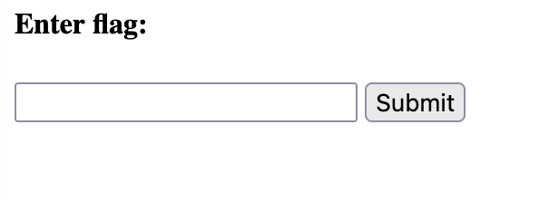
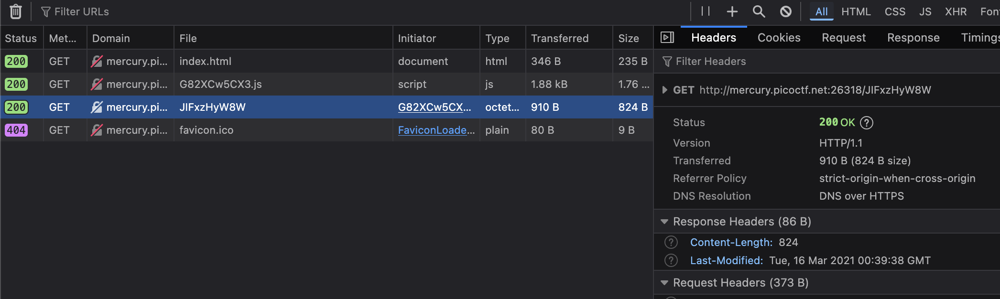

# PicoCTF: Some Assembly Required 

This README contains writeups for all levels of Some Assembly Required.
- Level 1: http://mercury.picoctf.net:26318/index.html 

## Context

We are provided with a URL that brings us to a very simple site that prompts us to enter a flag. We are given no source code or hints.



## Background Information: WebAssembly

[Add information about web assembly here for future parts.]

## Vulnerability

To gather more information, I decided to inspect the website. Navigating to the Networks tab, I found a couple of interesting things.



We see an executable file being used by the site. 

## Exploitation

To try to see what it may do, I decided to `curl` it by doing `curl http://mercury.picoctf.net:26318/JIFxzHyW8W > exec`. To get more information about what kind of executable this is, I did `file exec`:

`exec.wasm: WebAssembly (wasm) binary module version 0x1 (MVP)`

We see the binary is a WebAssembly file, thus I renamed `exec` to `exec.wasm`. I also ran `strings exec.wasm` to try to get more information, and that's where I found the flag:

```text
madalinastoicov@Madalinas-MacBook-Air-2 level-1 % strings exec.wasm
memory
__wasm_call_ctors
strcmp
check_flag
input
copy_char

__dso_handle
__data_end
__global_base
__heap_base
__memory_base

__table_base
 
 j!
  F!!A
!" ! "q!# #
!% $ %q!& 
!( ' (q!) & )k!* 
!+ +
+picoCTF{8857462f9e30faae4d037e5e25fee1ce}
```

## Remediation

A vulnerability we see here is that critical information is not secured, and therefore can be easily seen amongst the rest of a binary file. One way to prevent this could be encrypting this data. Or, not making the binary file available to the client is also an option.

# Sources/Credits

Written by Madalina Stoicov
