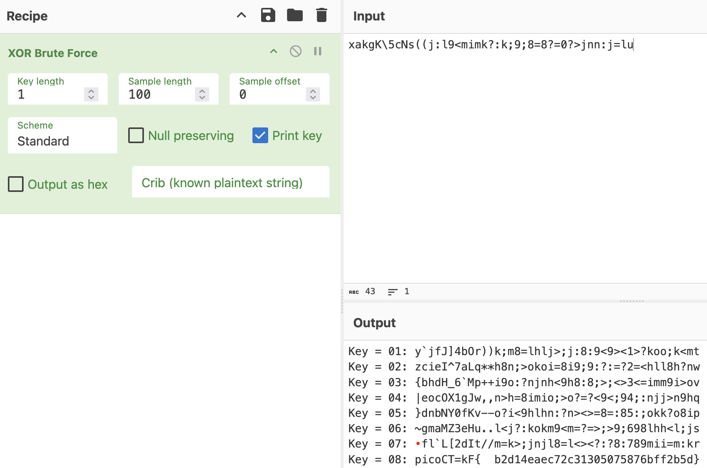

# PicoCTF: Some Assembly Required 

This README contains writeups for all levels of Some Assembly Required. Because levels 1 and 2 are quite simple, I've only breifly described those levels and have written more in-depth explanations for levels 3 and 4.
- [Level 1](http://mercury.picoctf.net:26318/index.html)
- [Level 2](http://mercury.picoctf.net:61778/index.html)
- [Level 3](http://mercury.picoctf.net:47240/index.html)

## Context (all levels)

We are provided with a URL that brings us to a very simple site that prompts us to enter a flag. We are given no source code or hints. This is the same for all levels.


## Background Information: WebAssembly (all levels)

WebAssembly (WASM) is a binary format for executable files that aims to make low-level programs in C, C++, and Rust more portable and used in web environments. Web Assembly Text Format (WAT) is the human-readable version of WASM. It is easy to read and resembles the register-by-register format of other assembly languages.

```WAT
export function strcmp(a:int, b:int):int { // func1
  var c:int = g_a;
  var d:int = 32;
  var e:int = c - d;
  e[6]:int = a;
  e[5]:int = b;
  var f:int = e[6]:int;
  e[4]:int = f;
  var g:int = e[5]:int;
  e[3]:int = g;
  ...
```

A useful tool for dealing with WASM and WAT files is [this WASM decompiler by Binaryen](https://github.com/WebAssembly/binaryen). This gives access to a useful WASM to WAT decompiler command:

`wasm-decompile input.wasm -o output.wat`

Another useful tool is the [Web Assembly Toolkit](https://github.com/WebAssembly/wabt). I found this one to be less helpful for this challenge, but it's nice to have on hand!

Web Assembly files can "export" certain functions/variables to be accessed in other scripts, like in JavaScript:

```WAT
export global input:int = 1072;
export global key:int = 1067;
```

## Vulnerability (all levels)

To gather more information, I decided to inspect the website. Navigating to the Networks tab, I found a couple of interesting things.


We see an executable file being used by the site, as well as a JavaScript file. 

Note: To see the files for each level, navigate to the level's subdirectory. The JavaScript file can be used for levels 1 and 2, but I was able to solve those levels without it, and therefore they are not included in the level subdirectories.

## Exploitation: Level 1

To try to see what the exectable may do, I decided to `curl` it by doing `curl http://mercury.picoctf.net:26318/JIFxzHyW8W > exec`. To get more information about what kind of executable this is, I did `file exec`:

`exec.wasm: WebAssembly (wasm) binary module version 0x1 (MVP)`

We see the binary is a WebAssembly file, thus I renamed `exec` to `exec.wasm`. I also ran `strings exec.wasm` to try to get more information, and that's where I found the flag:

```text
madalinastoicov@Madalinas-MacBook-Air-2 level-1 % strings exec.wasm
memory
__wasm_call_ctors
strcmp
check_flag
input
copy_char

__dso_handle
__data_end
__global_base
__heap_base
__memory_base

__table_base
 
 j!
  F!!A
!" ! "q!# #
!% $ %q!& 
!( ' (q!) & )k!* 
!+ +
+picoCTF{8857462f9e30faae4d037e5e25fee1ce}
```

## Exploitation: Level 2

I tried doing the same process as level 1: grabbing the executable and running `strings` on it. However, I see that that the flag seems to be encoded this time: 

`xakgK\5cNs((j:l9<mimk?:k;9;8=8?=0?>jnn:j=lu`

Before doing some more advanced decoding, I tried running this string through some basic decoders on CyberChef. After a couple of attempts and different schemes, I found that the flag is XORd:



## Exploitation: Level 3

I started solving this level by executing the same steps as levels 1 and 2: grab the executable by using `curl` and running `strings`. For this part, we don't see anything that may resemble a flag:

```text
madalinastoicov@Madalinas-MacBook-Air-2 level-3 % strings exec.wasm
memory
__wasm_call_ctors
strcmp
check_flag
input
copy_char

__dso_handle
__data_end
__global_base
__heap_base
__memory_base

__table_base
 
 j!
  F!!A
!" ! "q!# #
!% $ %q!& 
!( ' (q!) & )k!* 
!+ +
 
 t!
 
 u!
```

We realize we need to get more information to solve this level. Recall that WebAssembly binaries can be decompiled to WAT formats to be more easily read:

`wasm-decompile exec.wasm -o decompiled_wasm.wat`

Indeed, we see a more human-readable assembly-like format (see `level-3/decompiled_wasm.wat` for complete source code). Before taking the time to analyze the WAT file, I also decided to look at the JavaScript we found earlier.

The raw JavaScript (seen in `level-3/src.js`) is obfuscated and very hard to read. I started by passing it into a [JavaScript deobfuscator](https://deobfuscate.io/) and then manually deobfuscated. I realized the array given at the beginning of the file represented the strings needed to fill in the rest of the file. The (mostly) deobfuscated JavaScript can be found at `level-3/src_clean.js`. This is what we see is happening in the file:

- A function grabs the first element of the given array of strings
- A function rotates the members of the array until a certain stopping condition is met. This stopping condition is when a certain algorithm determined by a series of parsed strings matches the passed in integer.
- A function fetches the Web Assembly code corresponding with the challenge and grabs its exports.
- A function that we see in the source HTML (onButtonPress) grabs the user's input flag, performs a `copy_char` function on it for its entire length, and then performs a `check_flag` operation on it. Both of these external functions are referred to with "exports", so we know we must refer to the WASM/WAT file to see what those functions do.

Next we analyze the `decompiled_wasm.wat` file and find the following:
- We have a memory region assigned `global g_a:int = 66864;`
- We also have input and key memory regions:`export global input:int = 1072; export global key:int = 1067;`
- The data stored in those input and key regions is shown:
```WAT
data d_nA372e6(offset: 1024) =
  "\9dn\93\c8\b2\b9A\8b\94\c6\df3\c0\c5\95\de7\c3\9f\93\df?\c9\c3\c2\8c2\93"
  "\90\c1\8ee\95\9f\c2\8c6\c8\95\c0\90\00\00"; //flag
data d_b(offset: 1067) = "\f1\a7\f0\07\ed"; //key
```
- There are some basic `strcmp` and `check_flag` functions.
- There is a `copy` function, which we see performs some specific operations to its inputs. We realize that this what `copy_char` was referencing in the JavaScript file. Therefore, that means that this is the string scrambling function performed on the flag data specified above.

Our task is to analyze this `copy` function and perform the same operations on the flag data.

```WAT
function copy(a:int, b:int) { // func3
  var c:int = g_a;
  var d:int = 16;
  var e:int_ptr = c - d;
  e[3] = a;
  e[2] = b;
  var f:int = e[3];
  if (eqz(f)) goto B_a;
  var g:int = 4;
  var h:int = e[2];
  var i:int = 5;
  var j:int = h % i;
  var k:ubyte_ptr = g - j;
  var l:int = k[1067];
  var m:int = 24;
  var n:int = l << m;
  var o:int = n >> m;
  var p:int = e[3];
  var q:int = p ^ o;
  e[3] = q;
  label B_a:
  var r:int = e[3];
  var s:byte_ptr = e[2];
  s[1072] = r;
}
```
After analyzing the function, we see it does the following:

- Go through each element of the flag data and grab the ASCII value of it, as well the as number iteration you're on (i)
- Perform `4 - (b % 5)` to get the index of the key
- XOR the ASCII value with the key[idx]

We may translate these steps into Python to make our solve script:

```Python
flag = "\x9dn\x93\xc8\xb2\xb9A\x8b\x94\xc6\xdf3\xc0\xc5\x95\xde7\xc3\x9f\x93\xdf?\xc9\xc3\xc2\x8c2\x93\x90\xc1\x8ee\x95\x9f\xc2\x8c6\xc8\x95\xc0\x90\x00\x00"
key = "\xf1\xa7\xf0\x07\xed"

for i in range (len(flag)):
    a = ord(flag[i])
    b = i

    idx = 4 - (b % 5)

    key_val = key[idx]

    r = a ^ ord(key_val)

    print(chr(r), end="")
```

Executing the solve script results in the flag being printed: `picoCTF{37240bd3038b289d3a5c70cbe83a1821}`

## Exploitation: Level 4

Part 4 will come at a later date :) 

## Remediation

There are multiple vulnerabilities in these challenges that could be patched. Firstly, the JavaScript obfuscation was very easy to undo, so some stronger obfuscation would prevent the script from being un-translated. Another obvious fix is to not calculate flag data client-side, but instead do those operations server-side where a user can't just access the object file. Another option may be making the WASM file harder to decompile.

# Sources/Credits

Written by Madalina Stoicov

- https://en.wikipedia.org/wiki/WebAssembly
